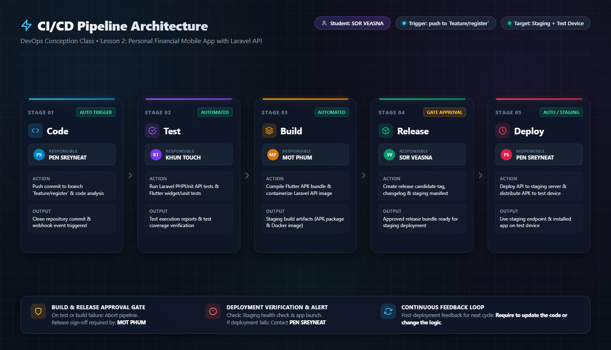

# DevOps Conception Class

- Student: SOR VEASNA

## Lesson 2: My CI/CD pipeline

- Project: Personal Financial Mobile App with Laravel API
- Trigger: Push to `feature/register` branch
- Target: Staging + test device

### Pipeline design

Code -> Test -> Build -> Release -> Deploy

1. Code: commit code | PEN SREYNEAT| [Register Screen] | [manual]
2. Test: check code | KHUN TOUCH | [check register Screen] | [auto/manual]
3. Build: build flutter build apk --release | MOT PHUM | [apk file] | [auto]
4. Release: tag new version v.0.0.1 | SOR VEASNA | [apk file v.0.0.1] | [manual]
5. Deploy: Upload new apk to app distribution | SOR VEASNA | [apk file v.0.0.1] | [manual]

### Controls

On test/build failure: notify to group chat | Release approval by: MOT PHUM
After deployment, check: login, register, and other features | If it fails: Contact to PEN SREYNEAT and report the issue in group chat / rollback to the previous version
Feedback for the next change: require to update the code or change the logic
Optional drawing: 
